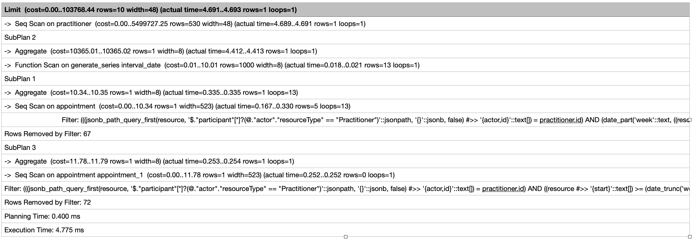

# AIDBOX COMPLEX QUERY

This example shown how to use Aidbox SDK and store complex query

### [Get Aidbox SDK](../README.md)

### Aidbox license
1. Create a new file in the root and name it ".env"
2. Open the .env file in a text editor.
3. In the .env file, write the following, replacing the values in angle brackets with real 

        VITE_AIDBOX_URL=<AIDBOX URL>
        VITE_AIDBOX_USERNAME=<AIDBOX CLIENT USERNAME>
        VITE_AIDBOX_SECRET=<AIDBOX CLIENT SECRET>

Make sure to replace values in angle bracket with your actual credentials

### Install Dependency

Make sure that your SDK archive have the same name as in the package.json

    npm install

### Run project
    
    npm run dev

### Optimization

#### Indexing

Indexes in PostgreSQL (and in other databases) are used to speed up
queries by providing quick access to specific data in a table.

In this project we get appointments count by field "start". Also, we filter appointments by practitioner id

    select practitioner.resource as practitioner,
       (select percentile_disc(0.5) within group
           (order by (select count(appointment)
                      from appointment
                      where jsonb_path_query_first(appointment.resource, '$.participant[*] ? (@.actor.resourceType == "Practitioner")') #>> '{ actor, id }' = practitioner.id
                        and date_part('week', (appointment.resource #>> '{ start }')::timestamp) = date_part('week',interval_date)
           ))
        from generate_series(now() - interval '3 months' , now(), interval '1 week') as interval_date
       ) as appointments_for_three_month,
       (select count(appointment) from appointment
        where (appointment.resource #>> '{ start }') between date_trunc('week', now() + '1 week')::text and date_trunc('week', now() + '2 week')::text
          and jsonb_path_query_first(appointment.resource, '$.participant[*] ? (@.actor.resourceType == "Practitioner")') #>> '{ actor, id }' = practitioner.id
       ) as next_week_appointments
    from practitioner limit 10 offset {{params.offset}}

Without indexing we get result 4.775ms

Then, let's write index on field "start"
      
    CREATE INDEX appointment_start ON appointment ((appointment.resource #>> '{ start }'));

And, for practitioner ID

    CREATE INDEX appointment_practitioner_id ON appointment (
      (jsonb_path_query_first(
         appointment.resource,
         '$.participant[*] ? (@.actor.resourceType == "Practitioner")'
      ) #>> '{ actor, id }')
    );

after indexing we get our data for 0.983ms

