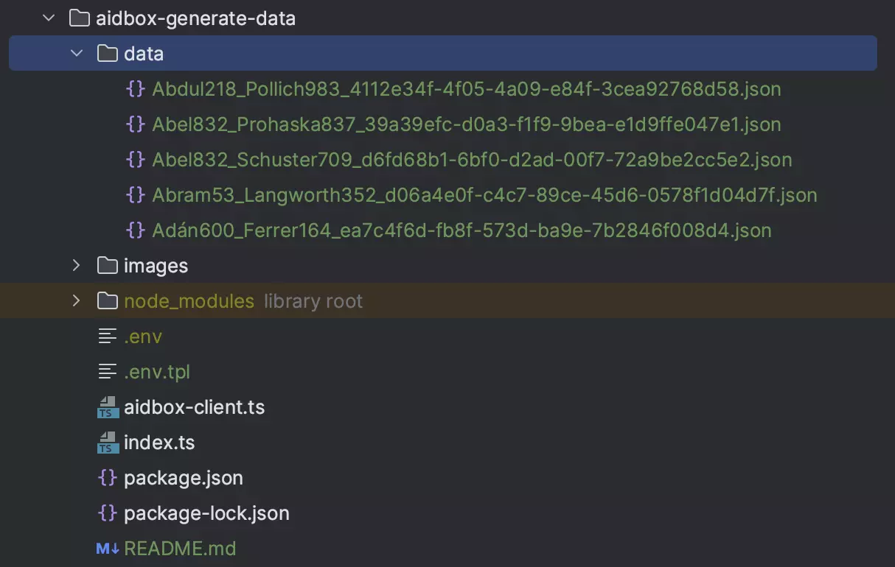

# AIDBOX GENERATE DATA

This example shown how to use Aidbox SDK and generate data useing [synthea](https://synthea.mitre.org/)

### [Get Aidbox SDK](../README.md)

### Aidbox license
1. Create a new file in the root and name it ".env"
2. Open the .env file in a text editor.
3. In the .env file, write the following, replacing the values in angle brackets with real 

        AIDBOX_BASE_URL=<AIDBOX URL>
        AIDBOX_CLIENT_ID=<AIDBOX CLIENT ID>
        AIDBOX_CLIENT_SECRET=<AIDBOX CLIENT SECRET>

Make sure to replace values in angle bracket with your actual credentials

### Install Dependency

Make sure that your SDK archive have the same name as in the package.json

    npm install

### Get synthea data

Create a folder "data" at the same level as index.ts

Then move output from synthea to this folder

As a result, you should get a similar folder structure

### Run script
    
    npm run start

