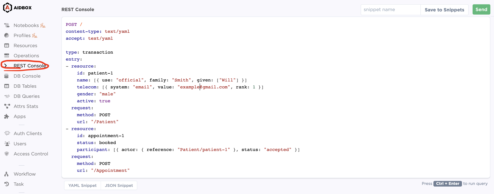
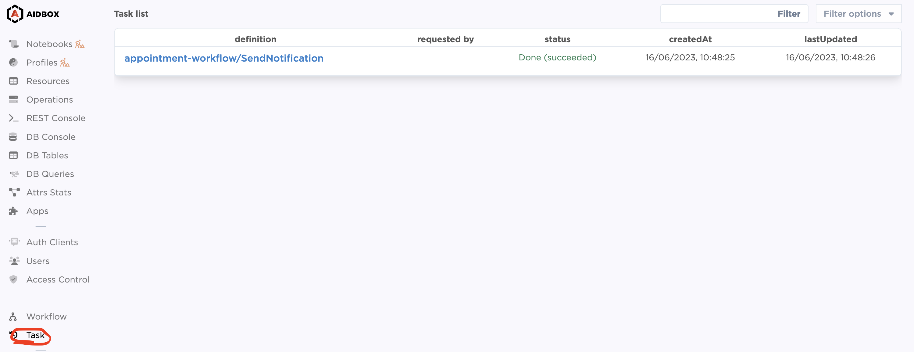

# AIDBOX WORKFLOW / TASK API SAMPLE

[The Aidbox workflow engine module](https://docs.aidbox.app/modules-1/workflow-engine) is the way to execute raliable, scalable and safe your complex business logic. The asynchronous nature of orchestration engine allows tasks to be processed independently, enabling parallelism that reduces processing time during load.

The example shows the flow of using Aidbox as a notification gateway service that [listens incomming appointments](https://docs.aidbox.app/modules-1/workflow-engine/services#subscription-trigger) and [spawns async tasks](https://docs.aidbox.app/modules-1/workflow-engine/task) for each of them. From other side we ( with SDK ) implements worker that is handling these tasks and send email to the patient.

## How to run the application

#### Step 1: Setup Aidbox

Go through all steps described in ["examples" directory](https://github.com/Aidbox/aidbox-sdk-js/blob/main/examples/README.md). As a result you should have aidbox up and running as a docker container available on `8888` port.

#### Step 2: Set Mailgun environment variables

Fill in credentials into `.env` file `MAILGUN_DOMAIN` and `MAILGUN_API_KEY` you can find the way to obtain them [here](https://docs.gravityforms.com/mailgun-api-key/). 

#### Step 3: Run the worker

```
ts-node-esm index.ts
```

## How to execute the workflow
#### Step 1: Create an appointment

Now the Aidbox instance is listening for a new appointment so let's create one. Move to Aidbox REST console in admin panel and execute following request that creates FHIR Appointment and Patient resources:

```yaml
POST /
content-type: text/yaml
accept: text/yaml

type: transaction
entry:
- resource:
    id: patient-1
    name: [{ use: "official", family: "Smith", given: ["Will"] }]
    telecom: [{ system: "email", value: "example@gmail.com", rank: 1 }]
    gender: "male"
    active: true
  request:
    method: POST
    url: "/Patient"
- resource:
    id: appointment-1
    status: booked
    participant: [{ actor: { reference: "Patient/patient-1" }, status: "accepted" }]
  request:
    method: POST
    url: "/Appointment"
```
We have to create a patient attached to appointment, because information about recipient as an email or recipient name we're getting from there.



#### Step 2: Check tasks section
When resources successfully created Aidbox has to execute for us a new task that you can find in Aidbox admin panel, in Task section. The name of the task should be "appointment-workflow/SendNotification" with status `[done]`. It means that our worker successfully sent the email.

P.S.: In the case when the task is in `[ready]` state, it means that our typescript worker is not able to connect to Aidbox and pull the task. Check previous steps.