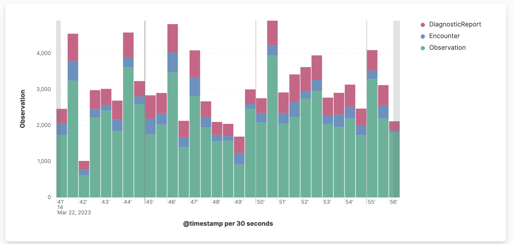

# AIDBOX SUBSCRIPTIONS API SAMPLE

[The Aidbox subscriptions module](https://docs.aidbox.app/api-1/reactive-api-and-subscriptions/subscriptions-1) is the way to subscribe and get notifications about updating resources on the server. It is a common denominator of FHIR R4/R5 subscriptions specification with some extensions.

This example shows the flow of working with aidbox subscriptions in the node js application.


## How to run the application

### Step 1: Environment variables

Create a new file in this directory with the name `.env` use `.env.tpl` as a reference.  

#### Step 2: Make sure you already have run docker containers

We have the same containers for all samples. You should run it from `/examples/` [folder](https://github.com/Aidbox/aidbox-sdk-js/tree/main/examples/README.md).

#### Step 3: Install dependencies

```bash
pnpm install
```

#### Step 4: Run nodejs application

```bash
pnpm run dev
```

#### Step 5: Run UI for this sample

For greater clarity, we have prepared UI for this example. You can run it from `/subscription-ui/` [folder](https://github.com/Aidbox/aidbox-sdk-js/tree/main/examples/apps/subscription-ui/README.md).

## Flow the application implements

### Step 1: [Create a subscription listener](https://github.com/Aidbox/aidbox-sdk-js/blob/main/examples/apps/subscription/src/app.ts#L57)

We want to create an endpoint in our backend service to handle our future Aidbox notifications about selected resource change.
Make sure that your http endpoint [responses](https://github.com/Aidbox/aidbox-sdk-js/blob/main/examples/apps/subscription/src/app.ts#L80) with `status: 200` on Aidbox subscription [handshake](https://docs.aidbox.app/api-1/reactive-api-and-subscriptions/subscriptions-1#protocol) request.

### Step 2: [Register a subscription in Aidbox](https://github.com/Aidbox/aidbox-sdk-js/blob/main/examples/apps/subscription/src/subscriptions.ts)

Then we have to tell Aidbox about our endpoint and register a subscription to resource that we want to be notified about changes for.
We provide `id`, `status`, `trigger`, and the `channel` with the endpoint that we created on step 1.

```typescript
aidbox.subscriptionEntry({
  id: "observation-created",
  status: "active",
  trigger: { Observation: { event: ["create"] } },
  channel: { endpoint: `${process.env.NODE_APP_URL}/observation-created` },
});
```

### Step 3: [Create queue](https://github.com/Aidbox/aidbox-sdk-js/blob/main/examples/apps/subscription/src/sqs.ts#L3) and [pushes](https://github.com/Aidbox/aidbox-sdk-js/blob/main/examples/apps/subscription/src/app.ts#L63) to queue

This part can be implemented in different ways and depends on your needs. But here we want to show the
most predictable and safe way to handle Aidbox events - instantly [redirect](https://github.com/Aidbox/aidbox-sdk-js/blob/main/examples/apps/subscription/src/app.ts#L63) them to a queue. By this approach we avoid
any load from endpoint handler place and move it to async workers that can be safe scaled horizontally.

### Step 4: [Implement simple worker](https://github.com/Aidbox/aidbox-sdk-js/blob/main/examples/apps/subscription/src/periodic-jobs.ts#L126) that will process notifications from the queue

There is the place where you want to keep your business logic. Just make any needed actions for each event in queue
asynchronously. In this sample we just [create](https://github.com/Aidbox/aidbox-sdk-js/blob/main/examples/apps/subscription/src/periodic-jobs.ts#L9C3-L9C3) "Task" resource for every notification.
In a real project, this notification can be tied to various business logic.

## Performance

In this section we want to show the performance of Aidbox FHIR API with subscriptions and
make sure that it's a good approach to use. Our goal is to see that subscriptions instantly reflects any changes
that happens with resources we interested in without any delays and problems.

Aidbox is able to integrate with [different services](https://docs.aidbox.app/core-modules/logging-and-audit/integrations/elastic-logs-and-monitoring-integration) for monitoring purpose. The current sample uses ElasticSearch for logs storing and Kibana for analyzing and visualizing data.
Also, we have the ability to [send logs from node application](https://github.com/Aidbox/aidbox-sdk-js/blob/main/examples/apps/subscription/src/app.ts#L75) through http directly to Aidbox using [sendLog](https://github.com/Aidbox/aidbox-sdk-js#sendlog).
This is a fine approach for applications with small infrastructure's size.

### Test characteristics

We register subscriptions for the Patient, Observation, Encounter and DiagnosticReport FHIR resources and upload some [synthetic data](https://github.com/synthetichealth/synthea) to aidbox.

We've been uploading ~100 resources per second and all of them triggered subscriptions and aidbox has been sending notifications to our endpoints for all created resources instantly.



We've been pushing all notifications to the queue from the Node application side.


