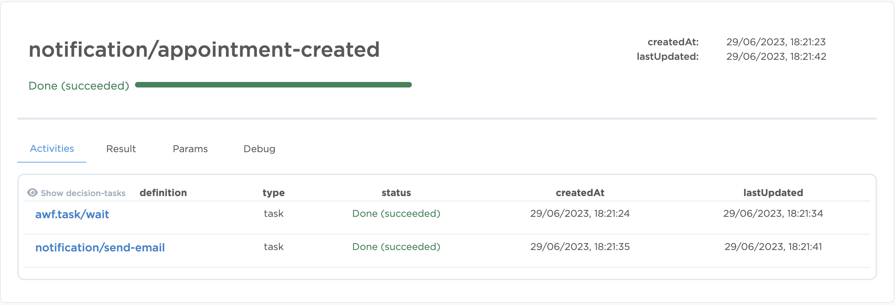

# AIDBOX WORKFLOW / TASK API SAMPLE

[The Aidbox workflow engine module](https://docs.aidbox.app/modules-1/workflow-engine) is the way to execute raliable, scalable and safe your complex business logic. The asynchronous nature of orchestration engine allows tasks to be processed independently, enabling parallelism that reduces processing time during load.

The example shows the flow of using Aidbox as a notification gateway service that [listens incoming appointments](https://docs.aidbox.app/modules-1/workflow-engine/services#subscription-trigger) and [executes workflows](https://docs.aidbox.app/modules-1/workflow-engine/workflow) for each of them. 
From the other side we implement workers with our business logic that handles these workflows.

## How to run the application

#### Step 1: Setup Aidbox

Go through all steps described in ["examples" directory](https://github.com/Aidbox/aidbox-sdk-js/blob/main/examples/README.md). As a result you should have Aidbox is up and running as a docker container available on `8888` port.

#### Step 2: Set Mailgun environment variables

Create a new file in this directory with the name `.env` use `.env.tpl` as a reference. Fill in credentials into `.env` file `MAILGUN_DOMAIN` and `MAILGUN_API_KEY` you can find the way to obtain them [here](https://docs.gravityforms.com/mailgun-api-key/). 

#### Step 3: Install dependencies

```bash
pnpm install
```

#### Step 4: Run nodejs application

```
pnpm run dev
```

#### Step 5: Run UI for this sample

For greater clarity, we have prepared UI for this example. You can run it from `/workflow-ui/` [folder](https://github.com/Aidbox/aidbox-sdk-js/tree/main/examples/apps/workflow-ui/README.md).

## How to execute the workflow
#### Step 1: Create an appointment

Now the Aidbox instance is listening for a new appointment so let's create one. Move to Aidbox REST console in admin panel and execute following request that creates FHIR Appointment and Patient resources:

```yaml
POST /
content-type: text/yaml
accept: text/yaml

type: transaction
entry:
- resource:
    id: patient-1
    name: [{ use: "official", family: "Smith", given: ["Will"] }]
    telecom: [{ system: "email", value: "example@gmail.com", rank: 1 }]
    gender: "male"
    active: true
  request:
    method: POST
    url: "/Patient"
- resource:
    id: appointment-1
    status: booked
    start: '2023-06-25T15:42:43.927Z'
    participant: [{ actor: { reference: "Patient/patient-1" }, status: "accepted" }]
  request:
    method: POST
    url: "/Appointment"
```
We have to create a patient attached to appointment, because information about recipient as an email or recipient name we're getting from there.


#### Step 2: Workflow and predefined tasks
When resources successfully created, Aidbox has to execute for us a new workflow instance that you can find in Aidbox admin panel, in Workflow section. The name of the instance should be "notification/appointment-created" with status `[in-progress]`.  
Activity should contain running task `awf.task/wait`, it's default Aidbox task that we use
in your example without implementation specific business logic, just [run it with until or duration params](https://docs.aidbox.app/modules-1/workflow-engine/task/aidbox-predefined-tasks#awf.task-wait).


#### Step 3: Send email to the Patient
As far as we reached 2 days out before the appointment our `awf.task/wait` should be completed and 
our workflow moves to the next step - send email.  

