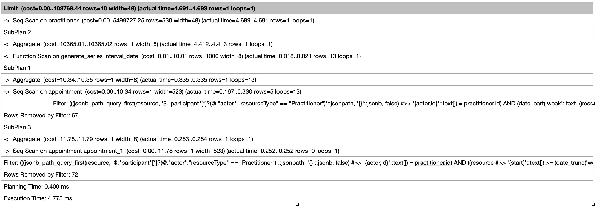
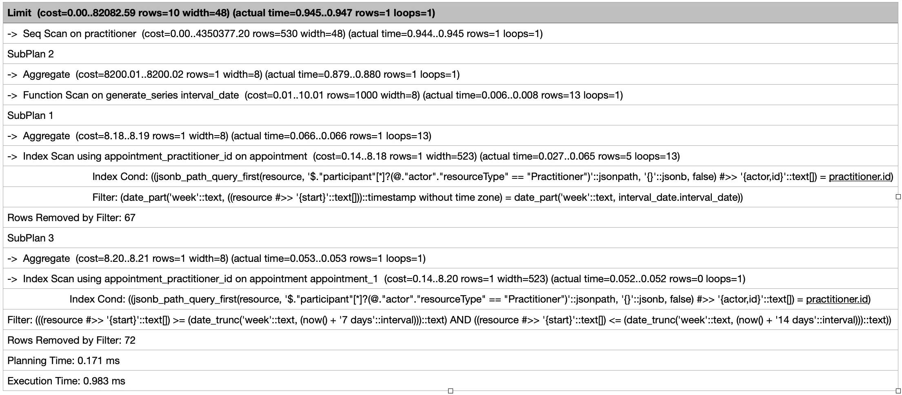

# AIDBOX COMPLEX QUERY

This example shown how to use Aidbox SDK and store complex query


### [Get Aidbox SDK](../README.md)

### Aidbox license
1. Create a new file in the root and name it ".env"
2. Open the .env file in a text editor.
3. In the .env file, write the following, replacing the values in angle brackets with real 

```dotenv
VITE_AIDBOX_URL=<AIDBOX URL>
VITE_AIDBOX_USERNAME=<AIDBOX CLIENT USERNAME>
VITE_AIDBOX_SECRET=<AIDBOX CLIENT SECRET>
```

Make sure to replace values in angle bracket with your actual credentials

### Install Dependency

Make sure that your SDK archive have the same name as in the package.json

    npm install


### Run project
    
    npm run dev

### Optimization

#### Indexing

Indexes in PostgreSQL (and in other databases) are used to speed up
queries by providing quick access to specific data in a table.

In this project we get appointments count by field "start". Also, we filter appointments by practitioner id

 ```sql
 SELECT practitioner.resource AS practitioner,
    (SELECT percentile_disc(0.5) WITHIN GROUP
        (ORDER BY (SELECT count(appointment)
                   FROM appointment
                   WHERE jsonb_path_query_first(appointment.resource, '$.participant[*] ? (@.actor.resourceType == "Practitioner")') #>> '{ actor, id }' = practitioner.id
                     AND date_part('week', (appointment.resource #>> '{ start }')::timestamp) = date_part('week',interval_date)
        ))
     FROM generate_series(now() - INTERVAL '3 months' , now(), INTERVAL '1 week') AS interval_date
    ) AS appointments_for_three_month,
    (SELECT count(appointment) FROM appointment
     WHERE (appointment.resource #>> '{ start }') BETWEEN date_trunc('week', now() + '1 week')::text AND date_trunc('week', now() + '2 week')::text
       AND jsonb_path_query_first(appointment.resource, '$.participant[*] ? (@.actor.resourceType == "Practitioner")') #>> '{ actor, id }' = practitioner.id
    ) AS next_week_appointments
 FROM practitioner LIMIT 10 OFFSET {{params.offset}};
```

Without indexing we get result 4.775ms



Then, let's write index on field "start"

```sql
CREATE INDEX appointment_start ON appointment ((appointment.resource #>> '{ start }'));
```

And, for practitioner ID

 ```sql
 CREATE INDEX appointment_practitioner_id ON appointment (
   (jsonb_path_query_first(
      appointment.resource,
      '$.participant[*] ? (@.actor.resourceType == "Practitioner")'
   ) #>> '{ actor, id }')
 );
 ```

after indexing we get our data for 0.983ms




