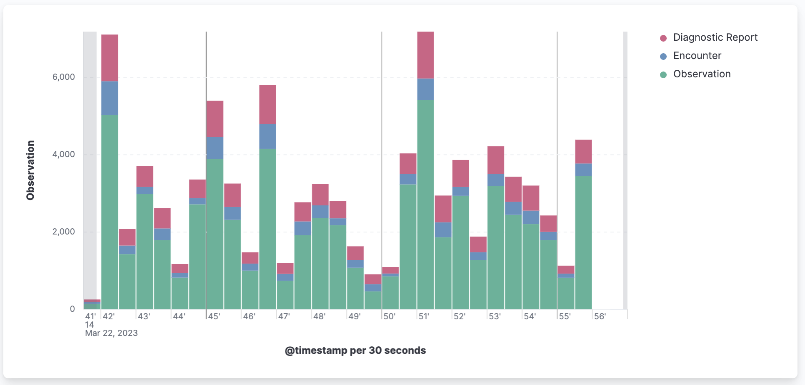

# AIDBOX SUBSCRIPTION SAMPLE

[Aidbox subscriptions module](https://docs.aidbox.app/api-1/reactive-api-and-subscriptions/subscriptions-1) is a way to subscribe and get notifications about updating resources on the server. It is a common denominator of FHIR R4/R5 subscriptions specification with some extensions.

This example shows the flow of working with aidbox subscriptions in the node js application.

### [Get Aidbox SDK](../README.md)

1.  Create a new file in the root and name it ".env"
2.  Open the .env file in a text editor.
3.  Fill in .env file using .env.tpl and add AIDBOX_LICENSE env.

### Install Dependency

Make sure that your SDK archive have the same name as in the package.json

    npm install

### Run docker containers

    make up

### Run nodejs application

    make backend

## Flow

1. [Create subscriptions](https://github.comAidbox/aidbox-sdk-js/blob/main/subscription-sample/src/subscriptions.ts) for needed resources.
2. [Create endpoints](https://github.com/Aidbox/aidbox-sdk-js/blob/c1347852b0894944b542db3096309c7e92a0bf7e/subscription-sample/src/endpoints.ts#L135) to handle notifications.
3. [Create queues](https://github.com/Aidbox/aidbox-sdk-js/blob/c1347852b0894944b542db3096309c7e92a0bf7e/subscription-sample/src/sqs.ts#L14) and [push notification](https://github.com/Aidbox/aidbox-sdk-js/blob/c1347852b0894944b542db3096309c7e92a0bf7e/subscription-sample/src/endpoints.ts#L9) to queue.

For better performance one the application side we use queue for handling notifications.

4. [Pull](https://github.com/Aidbox/aidbox-sdk-js/blob/f1660e6fffc2e2e936769f2f44e2491244cc4aa5/subscription-sample/src/periodic-jobs.ts#L11) and process notifications from the queue.

In this sample we just create "Task" resource for every notifications. In a real project, this notification can be tied to various business logic.

## Subscriptions performance

In this sample we use [integration](https://docs.aidbox.app/core-modules/logging-and-audit/integrations/elastic-logs-and-monitoring-integration) with ElasticSearch for logging. Also we [extend](https://github.com/Aidbox/aidbox-sdk-js/blob/f1660e6fffc2e2e936769f2f44e2491244cc4aa5/subscription-sample/src/endpoints.ts#L20) default Aidbox logs using [sendLog](https://github.com/Aidbox/aidbox-sdk-js#sendlog) method.

We created subscriptions for the Patient, Observation, Encounter and DiagnosticReport resources and upload some [Synthea](https://github.com/synthetichealth/synthea) data to aidbox.

We've been uploading ~3000 resources per 30 seconds and all of them triggered subscriptions and aidbox has been sending notifications to our endpoints for all created resources.

We've been pushing all notifications to the queue on the nodejs application side.

